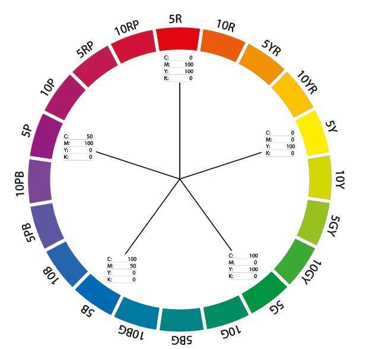

# graphic

- 인쇄용 **CMYK**

  [cyan] [magenta] [yellow] [black] 

- 웹용 **RGB**

  [red] [green] [blue]

### 해상도 

- dpi(dot per inch)   : 인치당 몇개의 점으로 이루어졌는지

- ppi(pixel per inch) : 인치당 몇개의 픽셀로 이루어졌는지

  > **dpi가 높을수록 화질 up** 

  

### 파일종류

- jpg  : 이미지파일. 배경o
- png : 이미지파일. 배경x. 인쇄x
- psd : 포토샵 전용파일. 2GB 제한
- psb : 대용량 포토샵 저장파일
- ai    : 일러스트레이터 전용파일
- eps : 일러스트레이터 인쇄용 
- pdf : 범용 저장형식 [모든 파일 열 수 있음]
- svg : ai파일 코드화

### 색채

- 색상환[hue]

  

  **색상은 항상 color 메뉴바에서 정수로 입력**

- 채도[saturation] : 순색과 탁색의 정도

- 명도[brightness] : 밝고 어두움의 정도 (**코딩에서는 개념이 다름**)

### ilustrator

##### View

- ctrl + y : 윤곽선만 보이게 
- alt + shift + ctrl + y : 인쇄용 미리보기
- alt +  ctrl + y : 웹용 미리보기

